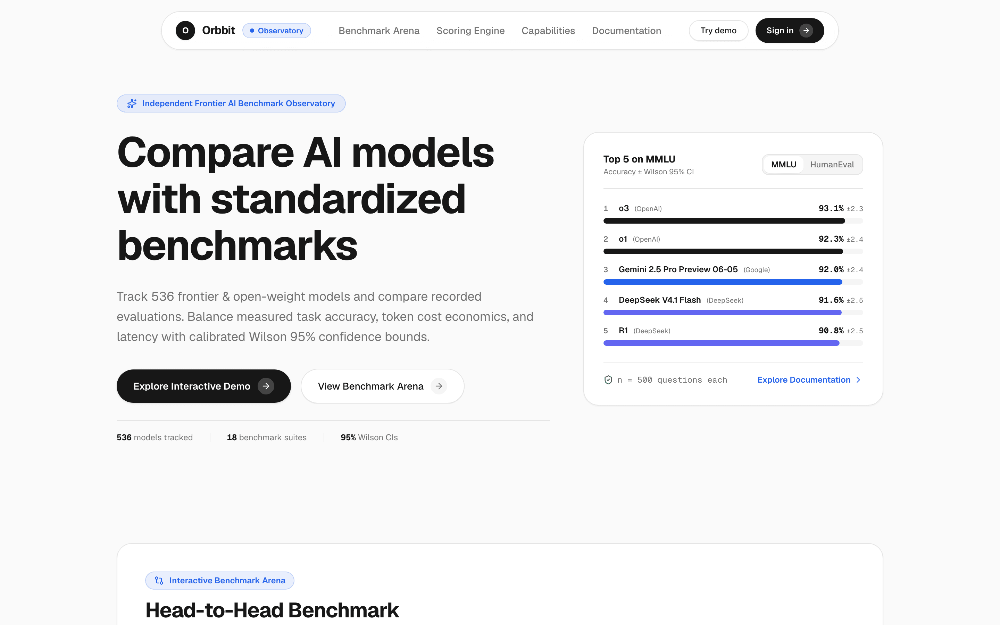
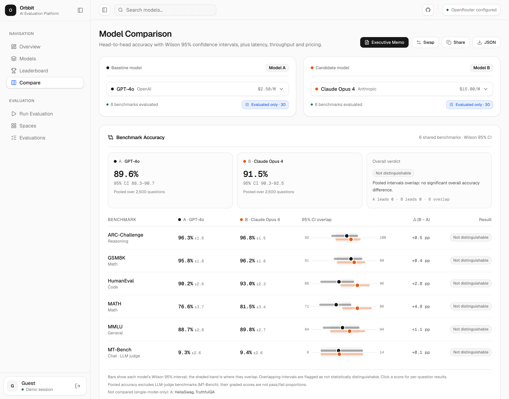
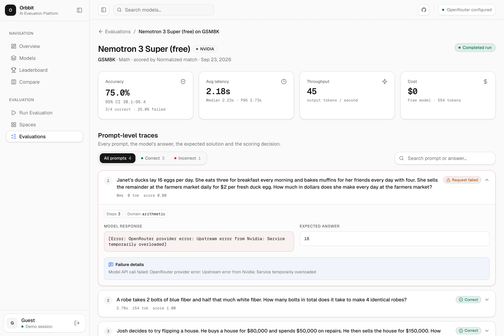
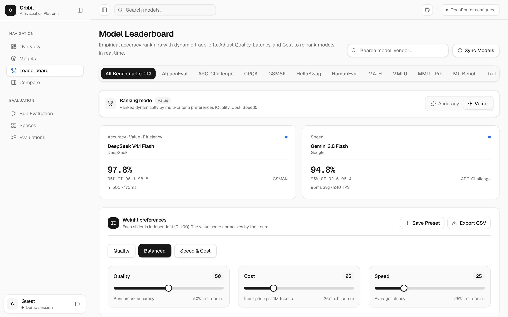
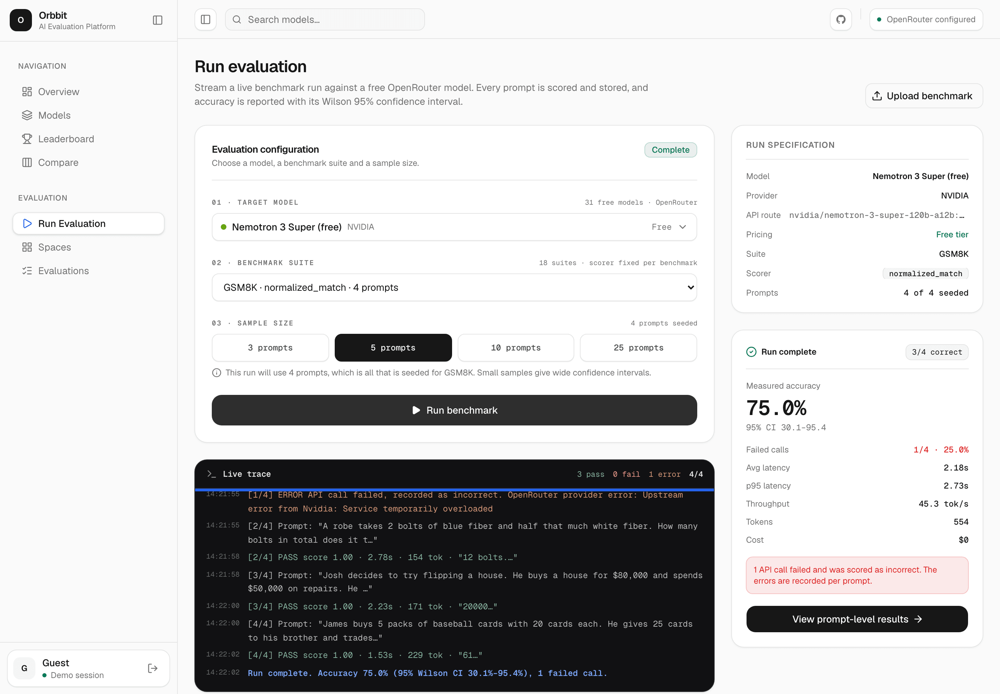
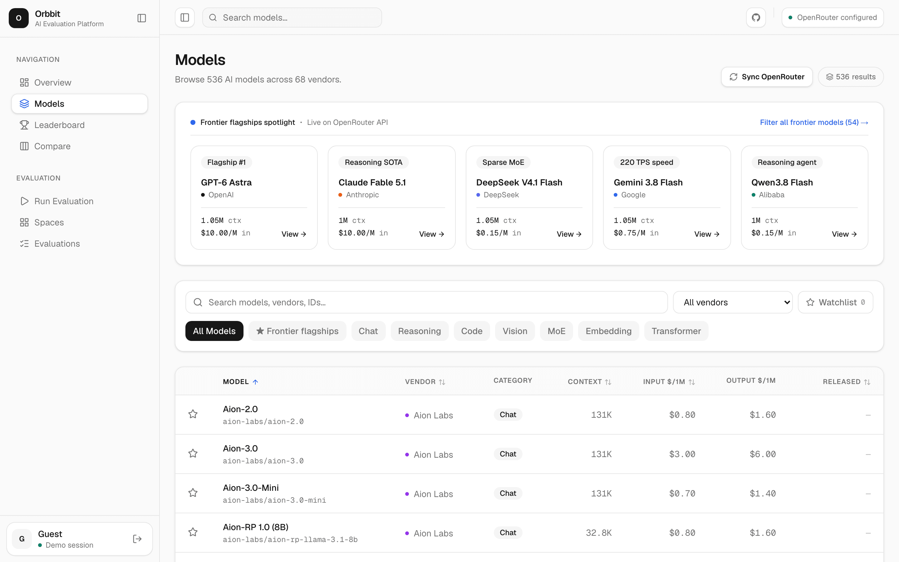
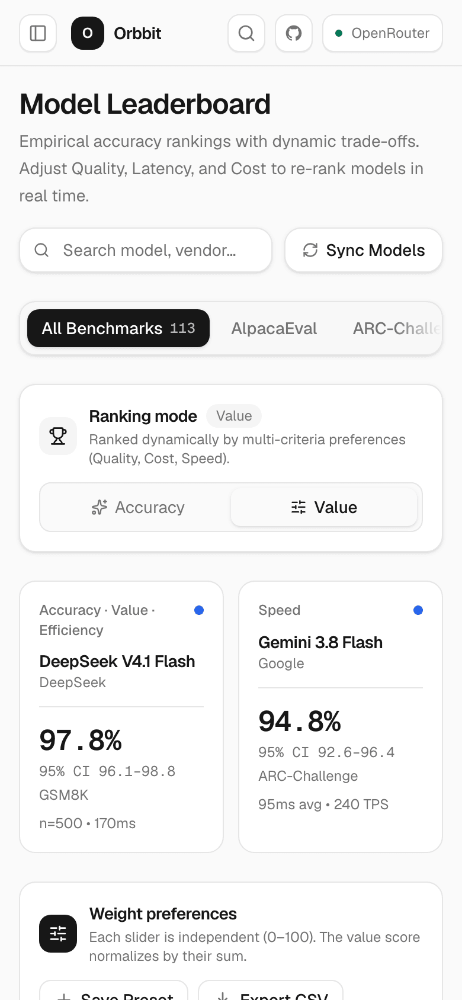
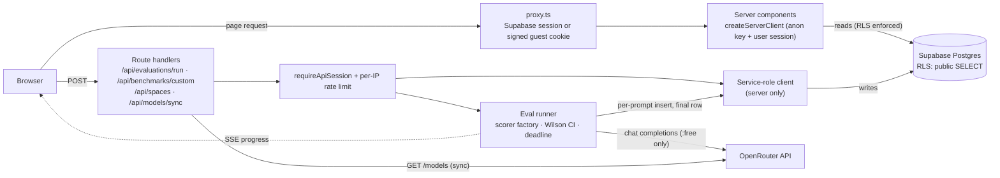

# Orbbit

**Compare AI models on accuracy, latency and cost, with a 95% confidence interval on every score.**

[](https://nextjs.org/)
[](https://react.dev/)
[](https://www.typescriptlang.org/)
[](https://tailwindcss.com/)
[](https://supabase.com/)
[](#testing)
[](LICENSE)



Orbbit is a Next.js 16 app for evaluating and comparing large language models. It keeps a catalog of OpenRouter models, stores benchmark evaluations down to each prompt, ranks models with a Value Score you weight yourself, and runs live benchmark evaluations on free OpenRouter models, streaming each prompt's result to the browser as it finishes.

## Why

Most leaderboards give one number per model. That hides three things teams need when they pick a model for production:

- **Uncertainty.** 86% vs 82% on 50 questions is not a real difference: the Wilson 95% intervals are 73.8–93.0 and 69.2–90.2. A score shown without its interval invites the wrong conclusion.
- **Trade-offs.** A model that is 2 points more accurate but 4x slower and 5x more expensive is often the wrong choice.
- **Evidence.** Teams need to see the exact prompts a model got wrong, not only the aggregate.

Orbbit puts those three things first.

## Features

### Wilson confidence intervals everywhere, and significance testing in Compare

Every accuracy in the UI is rendered by one component (`<AccuracyWithCI>`) that shows the Wilson 95% interval, or an explicit "CI n/a" when the bounds are missing. It never shows a bare percentage. The Compare view puts two models side by side for each shared benchmark, plots both intervals, and shades the region where they overlap. A difference is marked significant only when the intervals do not overlap. Pooled accuracy leaves out LLM-judge suites, because a graded score is not a pass/fail proportion.



### Prompt-level traceability

Clicking any aggregate score opens the evaluation drill-down. It shows every recorded prompt with the model's response, the expected answer, the scorer's reasoning, latency and tokens. You can filter by correct or incorrect and search the text. Failed API calls are recorded as failures with the upstream error message. They are never silently retried, because failure rate is itself a metric.



### Adjustable Value Score leaderboard

The leaderboard ranks models by accuracy or by a composite **Value Score** built from quality, cost and speed. The three sliders are independent (each 0–100), and the score is normalized by their sum (see [Scoring math](#scoring-math)). The weights, benchmark filter, mode and search all live in the URL, so a view can be shared by copying the link. Presets (Quality, Balanced, Speed & Cost) are built in, custom presets are saved in the browser, and the ranked table exports to CSV with CI bounds.



### Live, streaming evaluation runner on free models

`POST /api/evaluations/run` runs a benchmark against any `:free` OpenRouter model and streams progress to the browser over Server-Sent Events. It emits `init`, then `question_start` and `question_complete` for each prompt, then `eval_complete`, plus `truncated` if the time budget runs out. Each prompt's result is written as soon as it finishes. The final row stores accuracy with its Wilson CI, average, median and P95 latency, tokens per second, failure rate, and cost calculated from the tokens reported in the API response.

The runner works within the route's 300 s limit. It stops starting new prompts when time runs low and finalizes on the prompts that actually ran, which gives an honestly wider CI. A run where no prompt succeeds is marked `failed` with accuracy set to `NULL`. Runs left `running` past the limit are marked failed ("stalled") later.



### Bring your own benchmark

You can upload a CSV (`prompt`/`question` and `expected_answer`/`answer` columns) or a JSON array of `{ prompt, expected_answer }` objects, up to 5 MB and 500 questions. The scoring method is set once for the benchmark (`exact_match`, `normalized_match`, `pass_at_k` or `llm_judge`) and must map to a registered scorer. It is never chosen per run.

### OpenRouter catalog sync

**Sync OpenRouter** on the Models page (or **Sync Models** on the Leaderboard) pulls `GET /api/v1/models` and upserts names, context windows and per-1M-token pricing, with sanity caps on prices. Sync runs on demand. There is no background poller.



### Executive memo

From Compare, **Executive Memo** builds a printable one-page recommendation. It covers pooled accuracy with 95% CIs, specs, per-benchmark accuracy, and a list-price monthly cost projection with its assumptions stated (1M requests, 500 input and 200 output tokens each). It recommends a model only when the pooled intervals do not overlap. The memo can be printed or copied as plain text.

### Spaces: domain-level rankings

A **Space** is a named group of benchmarks that stands for one kind of work, such as Mathematics (GSM8K + MATH) or Code Generation (HumanEval + MBPP). Each space card shows:

- **Pooled accuracy.** Correct answers divided by scored questions across every completed evaluation on the member benchmarks, with a Wilson 95% interval over the pooled sample. Failed and unscored prompts are left out, as elsewhere.
- **Top model.** Each model's own pooled accuracy, ranked by the **lower** bound of its interval, so a lucky 3/3 run can't beat 180/200.
- **Links.** Each benchmark chip opens its evaluations, and "View in leaderboard" opens the leaderboard for Value Score trade-offs.

How to use it:

1. Describe your workload as benchmarks, for example a support bot as MT-Bench + AlpacaEval + TruthfulQA. Include your own uploaded benchmark if you have one.
2. On `/dashboard/spaces`, click **Create space**, then name it, pick an icon and select the benchmarks.
3. Evaluate each candidate model on every member benchmark (Run evaluation, or `pnpm eval:batch --benchmarks …`). A model counts only where it has completed evaluations.
4. Read the top model and its interval, then open Compare for the top two to see per-benchmark gaps. Overlapping intervals mean there is no clear winner.

Some caveats. Pooling weights benchmarks by question count. Benchmarks that aren't runnable yet (IFEval, DROP, LiveCodeBench, BBH, and GPQA without a Hugging Face token) add nothing. The six curated spaces are read-only and their names are reserved. Spaces have no per-user owner yet, so they are shared by everyone. The API is `POST /api/spaces { name, description?, icon?, benchmarkIds }` and `DELETE /api/spaces?id=`. The full guide is in the in-app docs at `/docs#spaces`.

### And also

- **Overview dashboard.** Catalog, suite and evaluation counts, top models with CIs, provider distribution, and recent runs.
- **Watchlist.** Star models in the catalog to keep a shortlist.
- **Responsive.** Dashboard tables keep the model column pinned on phones.

<p align="center">
  
</p>

## Where the scores come from

No score is seeded or hand-entered. Every evaluation row comes from Orbbit sending real benchmark questions to a `:free` OpenRouter model and grading each response with the benchmark's scorer:

| Step | What happens |
| :-- | :-- |
| **Questions** (`pnpm db:import:questions --write`) | A fixed, seeded random sample (default 200 per benchmark) of the real public datasets on Hugging Face: MMLU, MMLU-Pro, GSM8K, MATH-500, ARC-Challenge/Easy, HellaSwag, TruthfulQA (mc1), WinoGrande, HumanEval and MBPP (JavaScript ports from MultiPL-E), MT-Bench (first turn) and AlpacaEval. Every question records its dataset, split and row index. IFEval, DROP, LiveCodeBench and BBH have no faithful automatic scorer yet, so they get no questions and show as "not yet runnable". GPQA imports only with an `HF_TOKEN` that has accepted the dataset's terms. |
| **Runs** (Run evaluation page, or `pnpm eval:batch`) | Each prompt's response, verdict, latency and tokens are stored. Failed calls and responses the scorer cannot grade are recorded, excluded from accuracy and counted in the failure rate. They are never retried. |
| **Scorers** | Multiple choice: letter extraction (`exact_match`). GSM8K: numeric final answer. MATH: last `\boxed{}` with conservative LaTeX normalization (`normalized_match`). Code: the answer is **executed** against the MultiPL-E tests in a sandboxed worker, pass@1 (`pass_at_k`). Open-ended: pass/fail from a free LLM judge (`llm_judge`). AlpacaEval's reference is a text-davinci-003 baseline, so a pass there means "at least as good as the baseline". |

Free-tier limits shape the numbers. OpenRouter allows `:free` models 20 requests a minute, and 50 requests a day for accounts that never bought credits (1,000 a day after buying 10 credits). Upstream providers also throttle free traffic, so expect a visible failure rate. Samples are small and the Wilson intervals are wide. That is the honest result.

The landing page leaves out runs with fewer than 30 graded prompts. The leaderboard labels runs with fewer than 20 as "Provisional".

## Architecture



- **Reads.** Pages are React Server Components that query Supabase with the anon key and the user's session, so RLS is enforced. Client components receive their data as props, and there is no `useEffect` data fetching.
- **Writes.** RLS currently allows public `SELECT` and no row writes except on `profiles`. Mutations therefore go through route handlers that authenticate the caller (a Supabase user, or a guest session signed with HMAC-SHA256 and expiring after 7 days), apply a per-IP sliding-window rate limit (per instance, in memory), and then use a server-only service-role client. The service-role key never reaches the browser.
- **Model calls.** Every model call goes through `src/lib/openrouter/client.ts`, and no provider SDKs are used. Live runs reject any model id without the `:free` suffix.
- **Scoring.** The benchmark declares its `scoring_method`. `getScorer()` resolves it through a registry of scorers (`exact_match`, `normalized_match`, `pass_at_k`, `llm_judge`), with no `if/else` chains.
- **Immutability.** Completed scores are never updated. A re-run creates a new evaluation row, and views use the latest completed run for each model and benchmark.

The data model lives in `supabase/migrations/`: `models`, `benchmarks`, `benchmark_questions`, `evaluations`, `evaluation_results`, `spaces`, `space_benchmarks` and `profiles`.

## Scoring math

### Wilson score interval (95%)

For `k` correct out of `n` prompts, with `p̂ = k/n` and `z = 1.96`:

$$
\text{CI} = \frac{\hat p + \frac{z^2}{2n} \pm z\sqrt{\frac{\hat p(1-\hat p)}{n} + \frac{z^2}{4n^2}}}{1 + \frac{z^2}{n}}
$$

Implemented in `src/lib/eval/statistics.ts`. Unlike the normal approximation, it stays inside [0, 100] and behaves sensibly at small `n` and near 0% or 100%. Two models are called different only when their intervals do not overlap.

### Value Score

Each model's best run is normalized against the other models currently in view:

| Component | Normalization | Direction |
| :-- | :-- | :-- |
| Quality `q` | `accuracy / max_accuracy` | higher is better |
| Cost `c` | `1 − log10(1 + price) / log10(1 + max(max_price, 1))`, where price is $ per 1M input tokens | cheaper is better |
| Speed `s` | `1 − √latency / √max_latency`, using average latency (a run with no latency data scores 0) | faster is better |

$$
\text{Value} = 100 \cdot \frac{w_q\,q + w_c\,c + w_s\,s}{w_q + w_c + w_s}
$$

The weights `w_q`, `w_c` and `w_s` are independent sliders from 0 to 100 (default 50 / 25 / 25). Dividing by their sum keeps the score well-formed without making the sliders move each other. The log and square-root scales stop a single very expensive or very slow model from flattening everyone else's score.

## Tech stack

| Layer | Choice |
| :-- | :-- |
| Framework | Next.js 16 (App Router, Turbopack), React 19.2, TypeScript 5.9 (strict) |
| UI | Tailwind CSS v4 with semantic tokens, shadcn/ui on Base UI, Lucide icons, Motion, Sonner toasts |
| Charts | Recharts 3 |
| Data and auth | Supabase Postgres with RLS, Supabase Auth (email and password), `@supabase/ssr` |
| Models | OpenRouter REST (chat completions plus the models catalog) |
| Tests | Node's built-in test runner via `tsx` |

## Getting started

### Prerequisites

- Node.js 20.9 or later, and pnpm
- A Supabase project
- An OpenRouter API key (a free account works, since live runs only use `:free` models)

### 1. Install

```bash
git clone https://github.com/Fuzailkazi/orbbitAI.git
cd orbbitAI
pnpm install
```

### 2. Configure environment

```bash
cp .env.example .env.local
```

Fill in `NEXT_PUBLIC_SUPABASE_URL`, `NEXT_PUBLIC_SUPABASE_ANON_KEY`, `SUPABASE_SERVICE_ROLE_KEY`, `OPENROUTER_API_KEY` and `GUEST_DEMO_SECRET`. Every variable is documented in [`.env.example`](.env.example).

### 3. Create the schema

Apply the SQL files in `supabase/migrations/` in order (`001` through `006`). You can paste them into the Supabase SQL editor, or run `supabase db push` if the project is linked with the Supabase CLI.

### 4. Seed the catalog and import questions

```bash
pnpm db:seed:all                      # benchmarks, models, spaces (no scores, no questions)
pnpm db:import:questions              # dry run: fetch + transform the HF samples, show the plan
pnpm db:import:questions --write      # insert the questions (idempotent)
pnpm eval:batch --dry-run --n 40      # plan real runs on free models within today's quota
pnpm eval:batch --n 40                # run them (resumable; stops on the daily quota)
```

The seed catalog has about 180 models. Click **Sync OpenRouter** in the app to pull the full live catalog.

### 5. Run

```bash
pnpm dev
```

Open http://localhost:3000 and choose **Try demo** to explore as a guest, or sign up with email.

## Scripts

| Script | What it does |
| :-- | :-- |
| `pnpm dev` | Start the dev server (Turbopack) on :3000 |
| `pnpm build` | Production build |
| `pnpm start` | Serve the production build |
| `pnpm lint` | ESLint (`eslint-config-next`) |
| `pnpm test` | Run the unit tests in `tests/` |
| `pnpm db:seed` / `pnpm db:seed:all` | Seed benchmarks, models and spaces (never scores or questions) |
| `pnpm db:import:questions` | Import real benchmark questions from Hugging Face (dry run unless `--write`; `--benchmarks`, `--n`, `--replace`) |
| `pnpm eval:batch` | Run imported questions on free models (`--models auto`, `--benchmarks runnable`, `--n`, `--dry-run`) |
| `pnpm db:purge:seeded` | Remove legacy hand-entered evaluations (dry run unless `--yes`, which writes a verified backup first; `--include-legacy` also removes runs on the old synthetic questions) |

These scripts read `.env.local` and use the service-role key. They are the only place that key is used outside authenticated route handlers.

## Testing

```bash
pnpm test
```

All tests run with no network or database. They cover:

- **Scorers** (`tests/eval/scorers.test.ts`, `tests/eval/sandbox.test.ts`): letter extraction, numeric and LaTeX final answers, pass@1 by executing code in the sandbox (including escape attempts), the LLM judge's unscored path, and the scorer registry.
- **Dataset import** (`tests/eval/datasets.test.ts`): the deterministic sampler, every row transformer, and idempotent import planning.
- **Batch runs and purge** (`tests/eval/batch.test.ts`, `tests/lib/purge.test.ts`): quota budgeting, pacing, model ranking, and the seeded-row fingerprint.
- **Statistics** (`tests/eval/statistics.test.ts`): Wilson intervals, percentiles and throughput.
- **Stalled-run detection** (`tests/eval/stalled.test.ts`).
- **Guest session tokens** (`tests/lib/guest-demo.test.ts`): signing, tampering, expiry, and failing closed with no secret.
- **Rate limiter** (`tests/lib/rate-limit.test.ts`): the sliding window, per-key isolation, and 429 headers.
- **OpenRouter client** (`tests/lib/openrouter.test.ts`): only `:free` ids qualify, the judge never resolves to a paid model, cost comes from reported usage, and failed calls are thrown once and never retried.
- **Format helpers** and **protected-space** name normalization.

## Project structure

```
src/
├── app/
│   ├── page.tsx, landing-client.tsx   # public landing page (live data from Supabase)
│   ├── docs/                          # public methodology docs
│   ├── login/, signup/, auth/callback # Supabase Auth
│   ├── (dashboard)/dashboard/         # overview, models, leaderboard, compare,
│   │                                  # evaluate, evaluations/[id], spaces
│   └── api/                           # auth/demo, evaluations/run, benchmarks/custom,
│                                      # models/sync, spaces
├── components/                        # ui/ (shadcn), charts/, evaluations/, models/, layout/
├── lib/
│   ├── eval/                          # runner, statistics, scorers/, sandbox/, datasets/, batch/
│   ├── openrouter/                    # client, catalog sync, free-model rules
│   ├── supabase/                      # server, browser, route and admin clients
│   ├── api/                           # session guard, rate limiter, typed error responses
│   └── auth/guest-demo.ts             # signed guest cookie
├── hooks/                             # useFavorites, use-mobile
├── types/database.ts                  # database row types
└── proxy.ts                           # route guard (Next.js 16 proxy)
supabase/
├── migrations/                        # schema + RLS
├── seed*.ts                           # catalog seed (models, benchmarks, spaces)
└── import-questions.ts                # real benchmark questions from Hugging Face
scripts/                               # run-batch.ts (eval batch), purge-seeded-evaluations.ts
tests/                                 # node:test suites
```

## Roadmap

- **Background job queue (Inngest).** Move live runs off the request so they can go past the 300 s route limit, with the UI polling or subscribing for progress. Today runs execute inside the SSE request.
- **Row-level write policies.** Add `owner_id` to spaces, custom benchmarks and evaluations, with RLS insert, update and delete policies, so user writes stop depending on the service-role client.
- **More runnable benchmarks.** Faithful scorers for IFEval (instruction checks), DROP (F1) and LiveCodeBench, so they stop being "not yet runnable".
- **Stronger code isolation.** Move the pass@1 sandbox from a worker-thread `vm` context to a separate process or container.
- **Shared rate limiting.** Move the limiter to a shared store (such as Redis) for multi-instance deployments.
- **TTFT.** Stream model responses to measure time to first token. It is recorded as `null` today rather than estimated.

## License

[MIT](LICENSE) © 2026 Fuzail Kazi
